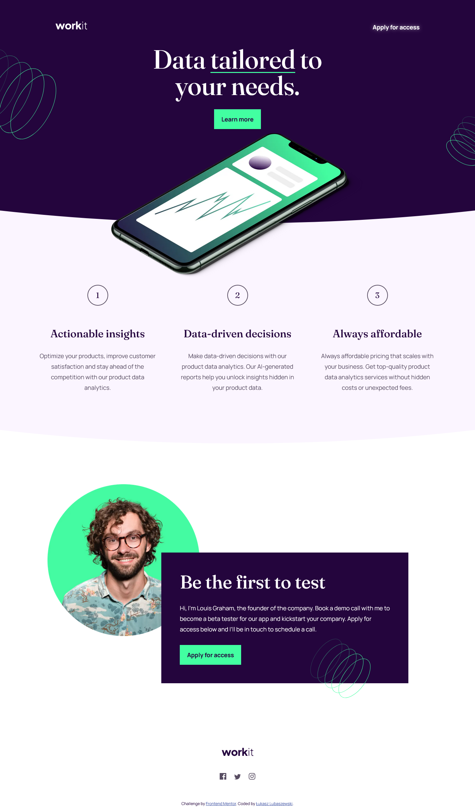

# Frontend Mentor - Workit landing page solution

This is a solution to the [Workit landing page challenge on Frontend Mentor](https://www.frontendmentor.io/challenges/workit-landing-page-2fYnyle5lu). Frontend Mentor challenges help you improve your coding skills by building realistic projects. 

## Table of contents

- [Frontend Mentor - Workit landing page solution](#frontend-mentor---workit-landing-page-solution)
  - [Table of contents](#table-of-contents)
  - [Overview](#overview)
    - [The challenge](#the-challenge)
    - [Screenshot](#screenshot)
    - [Links](#links)
  - [My process](#my-process)
    - [Built with](#built-with)
    - [What I learned](#what-i-learned)
    - [Useful resources](#useful-resources)
  - [Author](#author)

## Overview

### The challenge

Users should be able to:

- View the optimal layout for the interface depending on their device's screen size
- See hover and focus states for all interactive elements on the page

### Screenshot



### Links

- Solution URL: [Frontend mentor solution](https://www.frontendmentor.io/solutions/desktopfirst-landing-page-with-many-absolute-positioned-elements-3_oHqu4i4U)
- Live Site URL: [Github Pages](https://luckyszakul0.github.io/FM-workit-landing-page/)

## My process

### Built with

- Semantic HTML5 markup
- CSS custom properties
- Flexbox
- Desktop-first workflow
- Variable font files

### What I learned

I'm not really proud of CSS in this one, it's very messy. I guess I have to start using Sass.  
Despite that I'm satisfied that I managed to use clip-path for the rounded background sections and the secondary button action on hover.

```css
  clip-path: ellipse(150% 95% at 50% 0);
```

### Useful resources

- [CSS Reset](https://www.joshwcomeau.com/css/custom-css-reset/) - An awesome CSS Reset.

## Author

- Github - [Łukasz Lubaszewski](https://github.com/luckyszakul0)
- Frontend Mentor - [@luckyszakul0](https://www.frontendmentor.io/profile/luckyszakul0)